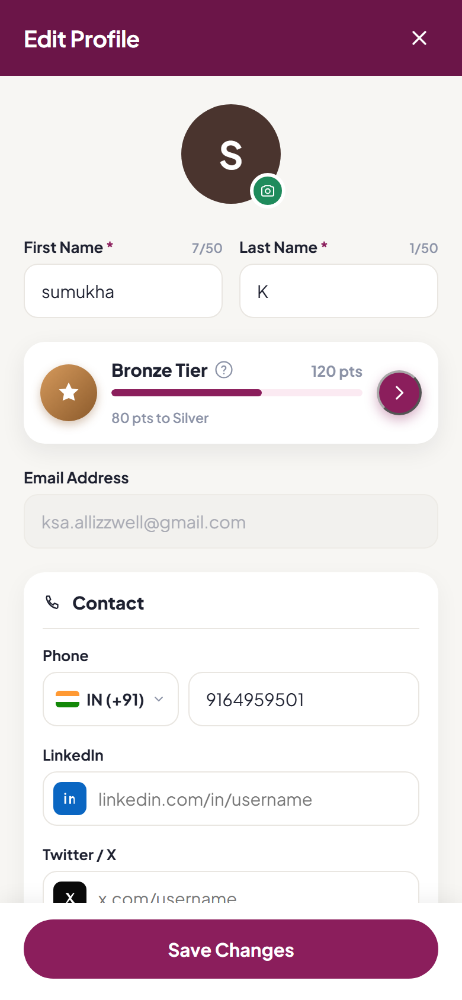
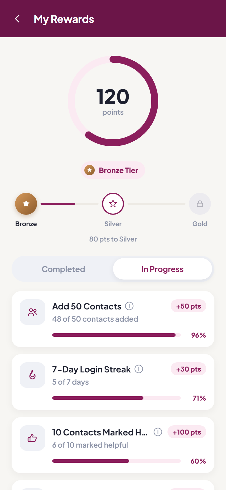
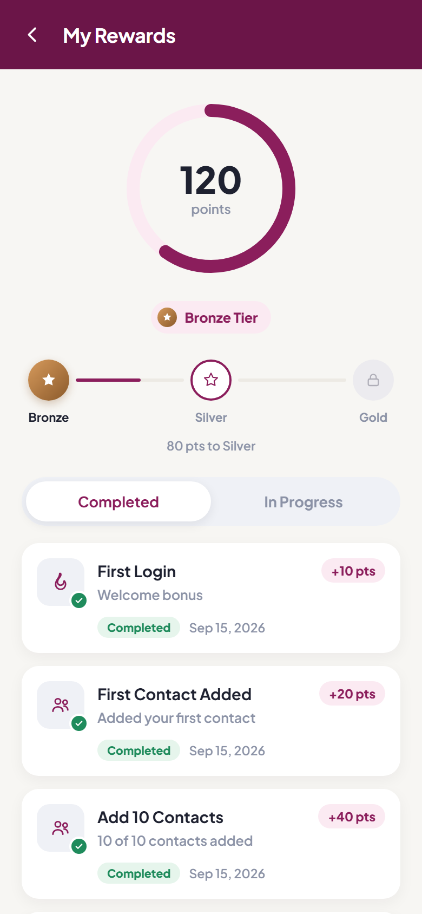
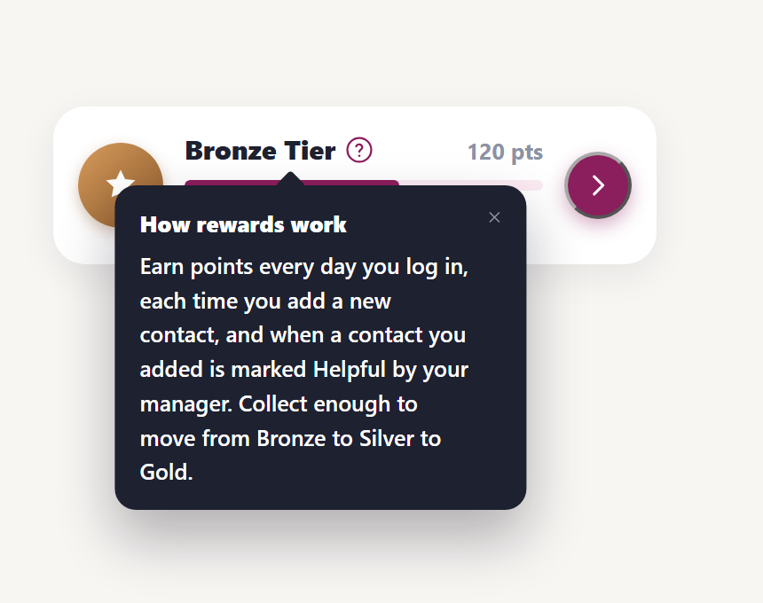
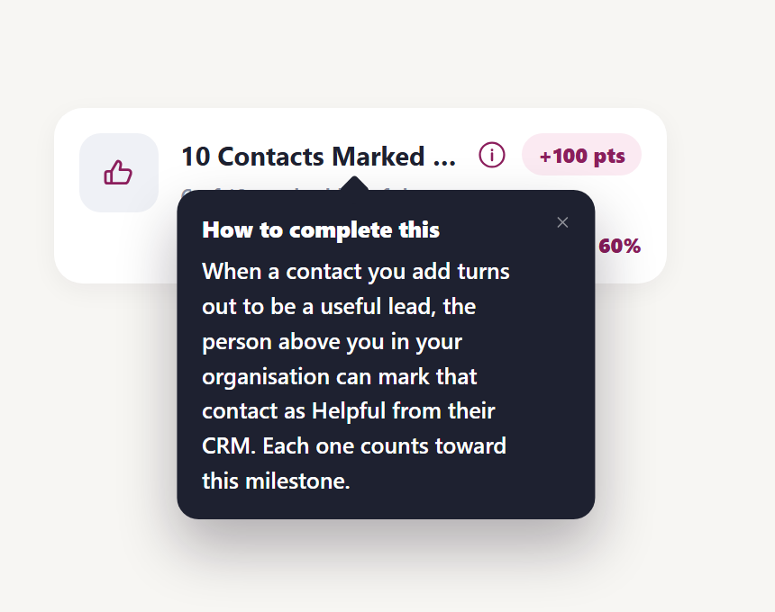

# All Buddy — Rewards

A gamified rewards feature for the **All Buddy** app, built with React Native (Expo) and TypeScript.

Users earn points for logging in daily, adding new contacts, and having contacts marked **Helpful** by their manager (e.g. a sales rep adds a lead at a networking event, and their superior later flags that contact as a good one). Points move a user up through **Bronze → Silver → Gold** tiers. This repo implements the two screens for that feature: a compact rewards summary on the Edit Profile form, and a full Rewards Details screen with milestone tracking.

## Screens

The screenshots below are the design mockups these screens are being built from (see [Screenshots](#screenshots)); the matching source lives under [`src/features/rewards`](src/features/rewards) and [`src/features/profile`](src/features/profile).

### 1. Edit Profile — Rewards teaser



The existing Edit Profile form (photo, name fields, contact details) with a new **Rewards card** inserted directly below the name fields. It shows the user's current tier (Bronze), a `?` icon that opens a short explanation of how rewards work, total points, a progress bar toward the next tier, and a magenta arrow button that opens the full Rewards Details screen.

### 2. Rewards Details — In Progress



Pushed from the arrow on the rewards card. The header shows the user's total points inside a progress ring, their current tier, and a Bronze → Silver → Gold path. Below two tabs, the **In Progress** tab lists milestones not yet completed — sorted nearest-to-completion first — each with a progress bar and an `i` icon explaining exactly what to do to finish it (e.g. how a contact gets marked Helpful).

### 2b. Rewards Details — Completed



The same screen with the **Completed** tab active: milestones already earned, each with a checkmark badge, the points awarded, and the date it was completed.

### Interaction detail — info tooltips

 

Two different info affordances, on purpose: the `?` on the rewards card explains the feature once; the `i` on each in-progress milestone explains that one task specifically, right where the doubt happens.

## Tech stack

- **Expo** (managed workflow) + **React Native** + **TypeScript**
- **React Navigation** (native stack) for the Edit Profile → Rewards Details flow
- **react-native-svg** for the icon set and the circular progress ring
- **expo-linear-gradient** for the tier medal badges
- **react-native-safe-area-context** for safe-area-aware layout across notches/home indicators on both platforms
- **@expo-google-fonts/plus-jakarta-sans** for the brand typeface
- **Jest** + **jest-expo** + **@testing-library/react-native** for unit and component/UI tests

Styling is plain `StyleSheet` against a shared design-token module ([`src/theme`](src/theme)) lifted from the existing All Buddy brand (magenta/plum, warm off-white ground, pill buttons and progress bars) so the new screens read as native to the app rather than a new design system.

## Project structure

```
src/
  theme/            colors, spacing, typography tokens
  components/        shared UI: Card, PrimaryButton, ProgressBar, TierMedal, InfoTooltip, icons
  navigation/         RootNavigator + route types
  features/
    profile/
      screens/        EditProfileScreen
    rewards/
      components/     RewardsTeaserCard, RewardsRing, TierPath, MilestoneCard
      data/           mock rewards data (stands in for the future rewards API)
      utils/          tier threshold / progress calculation
      screens/         RewardsDetailsScreen
      types.ts
```

## Getting started

Requires Node.js 18+, and either a physical device with **Expo Go** or an Android/iOS simulator.

```bash
npm install
npm start
```

Then press `a` for Android or `i` for iOS (iOS requires macOS), or scan the QR code with Expo Go.

## Testing

```bash
npm test              # run once
npm run test:watch    # watch mode
npm run test:coverage # with coverage report
npm run typecheck     # tsc --noEmit
npm run lint          # expo lint
```

Tests are co-located with the code they cover (`Component.tsx` / `Component.test.tsx`). Coverage includes:

- **Unit tests** for the tier-progress math (`src/features/rewards/utils/tierProgress.test.ts`) and mock-data sorting rules.
- **Component/UI tests** (React Native Testing Library) for every interactive piece: the rewards teaser card, milestone cards, the info tooltip's open/close behavior, and both screens' navigation and tab-switching behavior.

## Device size testing

The app has been run live on three Android emulators (small/medium/large screens) to confirm the UI holds up across real device sizes — see [`docs/screenshots/device-testing`](docs/screenshots/device-testing) for the screenshots and results. iOS hasn't been verified yet since that requires macOS/Xcode; see the notes in that folder for what's needed.

## Status

Design mockups and the two screens above are implemented against mock data (see `src/features/rewards/data/mockRewardsData.ts`) — there is no backend yet. Photo upload on Edit Profile is visual-only for now.
